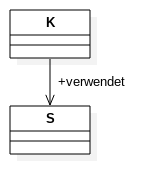
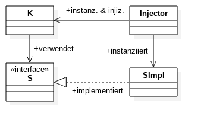

# Dependency Injection - Theorie und Praxis am Beispiel von Google Guice

n-design ist [OSGi][OSGi]-Verfechter der ersten Stunde. Dabei basiert die Überzeugung von dieser Technologie allerdings nicht auf der Technologie als solcher, sondern vielmehr auf OSGis Grundprinzipien, die zu einer strukturierten Architektur eines Softwaresystems durch Modularisierung und Serviceorientierung führen. In einer solchen Architektur bildet *Dependency Injection* einen grundlegenden Baustein. Gilt es nun Technologien für die Umsetzung neuer Projekte auszuwählen, steht OSGi als bevorzugtes und beherrschtes Mittel im Vordergrund.

Was jedoch, wenn nun kein komplexes System, sondern lediglich ein einfaches Java-Programm, ein (kommandozeilenbasiertes) Tool oder ein strukturiertes Maven-Plugin umgesetzt werden soll? Hier scheint OSGi als Technologie sicherlich überdimensioniert. Als leichtgewichtige Alternative konnten hier zuletzt gute Erfahrungen mit `Google Guice` gesammelt werden.

In diesem Blog-Beitrag soll das Thema *Dependency Injection* und die Design-Prinzipien, aus denen das Dependency Injection Pattern folgt, erläutert werden. Anschließend wird Google Guice als einfaches Framework zur Umsetzung von Modularität und Dependency Injection vorgestellt.

## Dependency Injection



Stellen wir uns folgendes Klassendesign vor: Zur Umsetzung seiner Funktionalität ist Klasse `K` vom konkreten Services `S` abhängig. Um diesen verwenden zu können, wird in `K` eine Instanz dieser Serviceklasse erstellt. So ausreichend diese Lösung zur reinen Realisierung der Funktionalität ist, führt sie jedoch zu einigen Unannehmlichkeiten:

* Ersetzen/Aktualisieren von `S`  in `K` nicht ohne Änderung des Quellcodes von `K` möglich 
* `S` muss in seiner konkreten Implementierung als Abhängigkeit von `K` bereits zur Kompilierzeit bekannt sein
* `K` ist schwer testbar, da es nicht möglich ist, `S` zu Testzwecken mit definierbarem Verhalten zu versehen (*Mocking*)



Eine Möglichkeit diese Unannhemlichkeiten zu beheben, stellte Martin Fowler in dem Artikel *[Inversion of Control Containers and the Dependency Injection pattern][DependencyInjection]* vor. *Dependency Injection* stellt dabei ein Designprinzip dar, dem die Idee eines *Plugin-Mechanismus* zugrunde liegt. Anstatt dass `K` den abhängigen Service `S` selbst instanziiert um diesen verwenden zu können, wird eine entsprechende Instanz von `S` von einem `Injector` in `K` hereingereicht.

### Design von Quellcode

Das Dependency-Injection-Designprinzip beeinflusst erheblich die Art und Weise, wie Klassenstrukturen entworfen werden. Jede Klasse hat aus fachlicher Sicht genau eine Aufgabe (*Single Responsibility*). Benötigt eine Klasse darüberhinaus zu Umsetzung der eigenen fachlichen Aufgabe externe Funktionalität, wird diese über Abhängigkeiten injiziert. Dies führt aufgrund kleiner und fachlich spezifischer Klassen zu testbarem, wartbarem und austauschbarem Code, bei dem...

* ... Klassen entkoppelt von Abhängigkeiten sind, sodass Ersetzen/Aktualisieren ohne Quellcode-Änderung geschehen kann.
* ... konkrete Implementierungen von Abhängigkeiten nicht zur Kompilierzeit bekannt sein müssen.
* ... durch Mocking von Abhängigkeiten Klassen isoliert testbar sind.

Als großer Vorteil ergibt sich zusätzlich aus diesem Designprinzip, dass eine Abhängigkeit in seiner Funktionalität nicht mehr nur eine reine *Library* darstellen muss, die eine Menge von unabhängig voneinander aufrufbaren Funktionen kapselt. Vielmehr ergibt sich dadurch die Möglichkeit *Frameworks* zu gestalten. Ein *Framework* gibt im Gegensatz zu einer *Library* ein abstraktes Design und eine Verhaltenssteuerung vor, wobei konkretes Verhalten an definierten Stellen ins Framwork integriert werden kann.

Im vorliegenden Beispiel könnte `K` zum Beispiel ein mathematisches Verfahren implementieren, für dessen Umsetzung mehrere Teilschritte notwendig sind. Diese werden im Interface `S` abstrakt definiert. Deren konkrete Implementierungen können nun in `SImpl` umgesetzt und zur Laufzeit von einem `Injector` in `K` injiziert werden. Dabei bleiben die konkreten Implementierungen der einzelnen Teilschritte austauschbar.

### Setter Injection und Constructor Injection

*Setter Injection* und *Constructor Injection* stellen zwei mögliche Arten dar, wie *Dependency Injection* in Java konkret umgesetzt werden kann. Anhand der nachfolgenden Beispiel-Methode werden die beiden Arten gegenüber gestellt und miteinander verglichen.

```java
public class SimpleLogger {
    private final Formatter formatter;
    
    public SimpleLogger() {
        this.formatter = new Formatter();
    }
    
    ...
}
```

Das obige Beispiel zeigt die Klasse `SimpleLogger`, die von einer Implementierung eines `Formatter` abhängig ist. Hier wird eine Instanz dieser abhängigen Klasse selbst erzeugt.

**Setter Injection**

*Setter Injection* beschreibt die Art der Injection, bei der Abhängigkeiten über hierfür vorgesehene Setter-Methoden injiziert werden können, nachdem die Klasse bereits instanziiert wurde.

```java
public class SimpleLogger {
    private Formatter formatter;

    public void setFormatter(Formatter formatter) {
        this.formatter = formatter;
    }
    
    ...
}
```

Vorteile:

* **Optionale Abhängigkeiten:**
Die Umsetzung von *optionalen* Abhängigkeiten wird dadurch möglich, dass eine Instanz der Klasse erzeugt werden kann, ohne dass Abhängigkeiten aufgelöst werden müssen. Durch diese Freiheit können Abhängigkeiten auch unaufgelöst bleiben.
* **Listen von Abhängigkeiten:**
Durch mehrmaliges Aufrufen einer Setter-Methode können, bei entsprechender Implementierung, mehrere Instanzen eines gleichen Typs injiziert werden. So könnten zum Beispiel mehrere Implementierungen des `Formatter` injiziert werden, die hintereinander aufgerufen werden könnten.
* **Keine Vermischung:**
*Technische* Abhängigkeiten werden über Setter injiziert, während Konstruktoren ausschließlich für *fachliche* Abhängigkeiten in Form von Daten, Konfigurationen etc. Verwendung finden. Hierdurch wird eine Vermischung von technischen und fachlichen Abhängigkeiten verhindert und die Lesbarkeit des Sourcecodes erhöht. Am Beispiel des `SimpleLogger` könnte dies bedeuten, dass ein `Formatter` über einen Setter gesetzt wird, während Informationen wie der Speicherort einer Log-Datei oder ein Log-Level über den Konstruktor definiert werden.
* **Änderung zur Laufzeit:**
Konkrete Instanzen von Abhängigkeiten können zur Laufzeit ausgetauscht werden, da Setter, anders als Konstruktoren, mehrfach aufgerufen werden können.

Nachteile:

* **Keine Forcierung:**
Durch die Tatsache, dass Instanzen von Klassen erzeugt werden können, ohne dass deren Abhängigkeiten über einen Konstruktor gesetzt werden **müssen**, werden alle Abhängigkeiten automatisch zu *optionalen* Abhängigkeiten. Es kann nicht gewährleistet werden, dass Abhängigkeiten einer Instanz einer Klasse wirklich aufgelöst wurden.

**Constructor Injection**

*Constructor Injection* beschreibt die Art der Injection, bei der Abhängkeiten über einen hierfür vorgesehenen Konstruktor bereits bei der Instanziierung der Klasse injiziert werden.

```java
public class SimpleLogger {
    private final Formatter formatter;

    public SimpleLogger(final Formatter formatter) {
        this.formatter = formatter;
    }
    
    ...
}
```

Vorteile:

* **Forcierung:**
Ist eine Instanz einer Klasse erstellt, dann ist sichergestellt, dass deren Abhängigkeiten definitiv aufgelöst werden konnten. Eine Instanziierung einer solchen Klasse ist sonst nicht möglich.
* **Reihenfolge:**
Klassen und deren Abhängigkeiten werden in einer Baumstruktur modelliert und die Instanziierung ausgehend von den untersten Blättern vorgenommen. Hierdurch geschieht die Erzeugung in einer definierten Reihenfolge. Setter hingegen könnten zu jedem beliebigen Zeitpunkt aufgerufen werden, was demzufolge eine beliebige Reihenfolge der Instanziierung von Abhängigkeiten erlaubt.

Nachteile:

* **Keine optionalen Abhängigkeiten:**
Optionale Abhängigkeiten sind im Konzept der Constructor Injection nicht vorgesehen. Dies könnte lediglich durch Überladung von Konstruktoren, wobei jede Kombination von Optionen umgesetzt sein muss, oder zusätzliche Setter erreicht werden.
* **Vermischung:**
*Technische* und *fachliche* Abhängigkeiten werden in einem Konstruktor zusammengefasst. Dies führt zu schlecht les- und wartbarem Code.
* **Statisch**
Es ist keine Ersetzung von abhängigen Instanzen zur Laufzeit möglich. Hier müsste wiederum mit einem zusätzlichen Setter abhilfe geschaffen werden.

## Google Guice

[Google Guice][GoogleGuice] ist ein Framework, mit welchem sich Dependency Injection in Java auf einfache Art und Weise umsetzen lässt. Es wurde von Google entwickelt, 2008 unter der Apache Lizenz veröffentlicht und befindet sich immer noch in reger Weiterentwicklung. Guice soll im folgenden vorgestellt werden, wobei jedoch ausschließlich auf die Funktionalität und nicht auf die interne technische Umsetzung eingegangen wird. Hierfür sei auf die *Internals*-Section unter [Google Guice][GoogleGuice] verwiesen.

Für diesen Blog-Beitrag wurde eine Beispiel-Applikation implementiert, die auf [Github][GithubGuiceApplication] zu finden ist. Diese Applikation stellt eine vollständige Google Guice Applikation dar, der die nachfolgenden Beispiele entnommen wurden.

### Verwendung

Google Guice findet zum Beispiel über eine Maven-Dependency Einzug in ein Java-Projekt.

```xml
<dependency>
	<groupId>com.google.inject</groupId>
	<artifactId>guice</artifactId>
	<version>4.1.0</version>
</dependency>
```

Ist diese Dependency bezogen, bietet Guice eine Vielzahl von `Annotationen`, über die Klassenstrukturen mittels Injections definiert werden können. Diese werden anschließend in einem `Modul` gebunden und können über einen `Injector` erstellt werden.

### Injections

> `@Inject` ist das neue `new`

Die Konfiguration von Injections basiert in Guice vornehmlich auf `Annotationen`. Dabei ist die wichtigste Annotation wohl `@Inject`. `@Inject` veranlasst das Framework, im hiermit annotierten Element eine abhängige Klasse zu ermitteln und die Injektion einer Instanz dieser Klasse vorzunehmen.

Dabei unterstützt Guice, um obige Theorie der *Dependency Injection* aufzugreifen, sowohl *Setter-* als auch *Constructor-Injection*, und darüber hinaus sogar eine über Reflection realisierte *Field-Injection*. Diese werden nachfolgend anhand des abgebildeten Interfaces `Logger` und einer entsprechenden Implementierung in Form eines `SimpleLogger` mit Abhängigkeit zu einem `Formatter` in konkreten Beispielen vorgeführt.

```java
public interface Logger {
    ...
}
```

**Constructor Injection**

```java
public class SimpleLogger implements Logger {
    private final Formatter formatter;

    @Inject
    public SimpleLogger(final Formatter formatter) {
        this.formatter = formatter;
    }
    
    ...
}
```

**Setter Injection**

```java
public class SimpleLogger implements Logger {
    private Formatter formatter;

    @Inject
    public void setFormatter(Formatter formatter) {
        this.formatter = formatter;
    }
    
    ...
}
```

**Field Injection**

```java
public class SimpleLogger implements Logger {
    @Inject
    private Formatter formatter;
    
    ...
}
```

### Bindings

Bei Verwendung einer `@Inject`-Annotation sucht das Framework in einer Menge von `Bindings` nach der Instanz einer konkreten Klasse, die an den Typ des annotierten Elements gebunden ist. `Bindings` beschreiben also, welche konkreten Instanzen von injizierbaren Klassen an welche Typen gebunden sind. Dabei unterschiedet Guice zwischen einer Vielzahl von möglichen Bindings, die im folgenden vorgestellt werden. 

**Linked Bindings**

`Linked Bindings` beschreiben Bindings, bei denen konkrete Klassen an abstrakte Typen gebunden sind. Die gewöhnlichste Forms dieses Bindings stellt dabei eine Implementierung eines Interfaces dar, die an den Typen des Interfaces gebunden wird. So wird etwa die konkrete Klasse `SimpleLogger` an das Interface `Logger` gebunden. Möglich ist aber auch ein Binding, bei dem eine konkrete Klasse an den Typ einer Unterklasse gebunden ist. 

```java
bind(Logger.class).to(SimpleLogger.class);
```

**Untargeted Bindings**

`Untargeted Bindings` sind Bindings, bei denen konkrete Typen nicht an abstrakte Typen gebunden werden. Hierbei ist ein mit `@Inject` beschriebenes Element mit dem konkreten Typ einer Klasse versehen. 

```java
bind(SimpleLogger.class);
```

**Named Annotations**

Über die `@Named`-Annotation können mehrere konkrete Implementierungen eines Typs gebunden und über Namen explizit referenziert werden. Als Beispiel könnte man sich hier vorstellen, dass mehrere Implementierungen eines `Formatter` in verschiedenen Ausprägungen existieren, die mit unterschiedlichen Namings gebunden werden.

Das `Binding` geschieht hierbei über eine zusätzliche Methode `annotatedWith`:

```java
bind(Formatter.class)
    .annotatedWith(Names.named("Default"))
    .to(DefaultFormatter.class);
```

Die Referenzierung beim `Inject` geschieht über die `@Named`-Annotation:

```java
public class SimpleLogger implements Logger {
    private Formatter formatter;

    @Inject
    public void setFormatter(@Named("Default") Formatter formatter) {
        this.formatter = formatter;
    }
    
    ...
}
```

**Instance Bindings**

Ein `Instance Binding` erlaubt das Binding einer konkreten Instanz einer Klasse an einen abstrakten Typ. Am Beispiel des `SimpleLogger` könnten eine Instanz dieses SimpleLoggers händisch erzeugt und an den Typ `Logger` gebunden werden.

```java
Logger logger = new SimpleLogger();
bind(Logger.class)
    .toInstance(logger);
```

Darüberhinaus könnte ein solches `Instance Binding` dazu verwendet werden, um Value-Objects, zum Beispiel globale Konfigurationsparameter, zu binden.

```java
bind(String.class)
    .annotatedWith(Names.named("LogFile"))
    .toInstance("/home/moe/logs/logger.log");
```

### AbstractModule

Zur Umsetzung von Modulen liefert Guice eine abstrakte Klasse `AbstractModule`, die von einem konkreten Modul, zum Beispiel im vorliegenden Fall etwa durch die konkrete Klasse `LoggingModule`, erweitert wird. `AbstractModule` definiert dabei eine abstrakte Methode `configure()`, die gewissermaßen die Komposition von Interfaces, deren Implementierungen und einer Menge von konkreten Instanzen mittels *Bindings* zu einem Modul realisiert.

```java
public class LoggingModule extends AbstractModule {
    @Override
    protected void configure() {
        bind(Logger.class).to(SimpleLogger.class);
        ...
    }
    
    ...
}
```

### Injector

Die Komposition von Modulen zu einem System werden in Google Guice über einen `Injector` realisiert. Der Injector wird dabei mit einer Menge von konkreten `AbstractModule`-Instanzen initialisiert, stellt zunächst die Relationen zwischen allen Objekten fest und erstellt hieraus einen Klassenhierarchien beschreibenden *Objektgraphen*. Anhand dieses Objektgraphen werden bereits bei der Erzeugung des Injectors alle notwendigen Instanzen von Klassen erstellt, und deren Abhängigkeiten mittels Dependency Injection aufgelöst. 

```java
public class Main {
    public static void main(String[] args) {
        Injector injector = Guice.createInjector(
            new LoggingModule(),
            new FormatterModule(),
            new ConfigurationModule()
        );
        ...
    }
}
```

Einzelne Instanzen können anschließend beim Injector abgefragt werden:

```java
Logger logger = injector.getInstance(Logger.class);
```

### But wait, there's more!

Neben den hier vorgestellten Elementen bietet Google Guice einige weitere, die im [Guice-Wiki](https://github.com/google/guice/wiki) nachzulesen sind und hier nur stichpunktartig ausgeführt werden.

* Bindings:
    * *Constructor Binding*: Erlaubt das Binding eines Typs an einen spezifischen Konstruktor einer Klasse.
    * *Provides*-Methode: Call-Back Methode, die zur Instanziierung eines bestimmten Typs verwendet wird, wobei das Binding über die Annotation `@Provides` hergestellt wird.
    * *Provider*-Bindings: Provided Methods nicht über Annotation `@Provides`, sondern durch die Implementierung eines `Provider`-Interfaces.
    * Built-in Bindings: Von Guice bereitgestellte Bindings (z.B. `java.util.logger.Logging`).
    * Just-In-Time Bindings
* [Scopes](https://github.com/google/guice/wiki/Scopes):
	* Standardmäßig wird bei jeder Injection eine neue Instanz der zu injizierenden Klasse erzeugt. *Scopes* bieten hier die Möglichkeit der Wiederverwendung von Instanzen. Hierzu existieren nachfolgende Klassen-Annotationen.
	* `@Singleton`: Wiederverwendung über den gesamten Lebenszyklus der Applikation
	* `@SessionScoped`: Wiederverwendung über eine gesamte Session
	* `@RequestScoped`: Wiederverwendung über einen Request
* [Extensions](https://github.com/google/guice/wiki/ExtendingGuice):
	* Guice bietet ein `Service Provider Interface` zur Implementierung von Erweiterungen und Plugins.
	* Es existieren einige offizielle Erweiterungen/Plugins.
	* Besonders Interessant: [Multibindings](https://github.com/google/guice/wiki/Multibindings) - Binding eines Interfaces zu einer Liste von Implementierungen

## Zusammenfassung

> Unix-Philosophie: *Make each program do one thing well.* 

Google Guice bietet Dependency Injection auf einfache Art und Weise und ist dabei deutlich leichtgewichtiger als etwa OSGi oder [Spring][Spring]. Der Grund liegt hier in der Fokussierung auf die eigentliche Kernfunktionalität: Während OSGi und Spring deutlich mehr Funktionaliät über Dependency Injection hinaus bieten, unterstützt Guice "lediglich" Dependency Injection und eine einfache aber sehr effektive Möglichkeit der Modularisierung und Serviceorientierung.

Dabei fundiert diese Einfachheit auf einer ebenso einfachen Architektur:

* `Injections` beschreiben Injektionen auf Klassenebene
* `Bindings` definieren injizierbare Typen und deren konkrete Ausprägung und bilden somit den Grundstein für *Services*
* `AbstractModules` komponieren über Bindings eine Menge von Klassen zu einem Modul
* Über einen `Injector` wird ein System aus einer Menge von Modulen komponiert, das eine Klassenhierarchie identifiziert, Klassen instanziiert und deren Abhängigkeiten injiziert.

Zusätzlich scheint sich Google Guice als hervorragende Grundlage zur Entwicklung eines "eigenen" Dependency-Injection-Frameworks zu eignen. Weiterentwicklungen mit Google Guice im Kern könnten sich etwa in folgenden Ausprägungen gestalten:

**1. Properties-basierte Bindings zur Laufzeit**

Bindings werden nicht mehr statisch im Sourcecode vorgenommen, sondern werden in Properties-Dateien beschrieben:

```java
# Linked Binding
de.ndesign.blog...api.LoggingService = de.ndesign.blog...core.SimpleLoggingService
# Untargeted Binding
de.ndesign.blog...core.MessageFragmentUtility =
# Named Annotation + Instance Binding
@Named#LogPath = /home/moe/log/logger.log
```

Hieraus würden zur Laufzeit folgende Bindings vorgenommen:

```java
bind(LoggingService.class).to(SimpleLoggingService.class);
bind(MessageFragmentUtility.class);
bind(String.class).annotatedWith(Names.named("LogPath")).toInstance("/home/moe/log/logger.log");
```
    
**2. Bindings über Annotationen**

Die Einführung einer `@Binding`-Annotation würde das definieren von Bindings vereinfachen. Diese würden bereits in den Klassen vorgenommen.

```java
@Binding(to = {LoggingService.class})
public class SimpleLoggingService implements LoggingService {
	...
}

@Binding
public class MessageFragmentUtility {
	...
}
```


[InversionOfControl]: http://martinfowler.com/bliki/InversionOfControl.html
[DependencyInjection]: http://www.martinfowler.com/articles/injection.html
[GoogleGuice]: https://github.com/google/guice/wiki
[GithubGuiceApplication]: https://github.com/moetz87/de.ndesign.blog.dependencyinjection
[OSGi]: https://www.osgi.org/
[Spring]: https://spring.io/